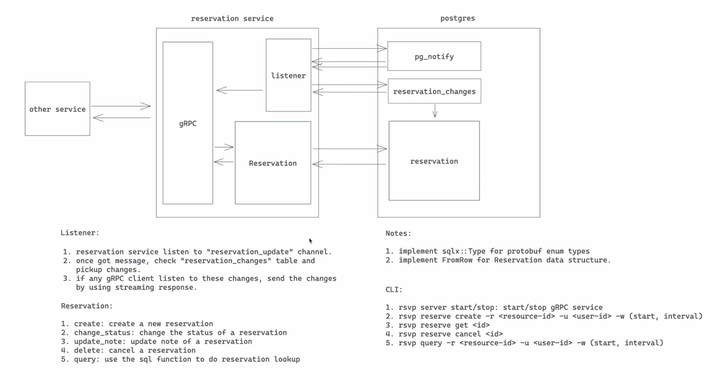

# Feature
- Feature Name: core-reservation
- Start Date: 2025-06-10 16:19:41

# Summary

A core reservation service that solves the problem of reserving a resource for a period of time. We leverage postgres EXCLUDE constraints to ensure that only one reservation can be made for a given resource at a given time.

# Motivation

We need a common solution for various reservation requirements:
1) calendar booking
2) hotel/room booking
3) meeting room booking
4) parking lot booking
5) etc.
Repeatedly building features for these requirements is a waste of time and resources. We should have a common solution that can be used by all teams.

# Guide-level explanation

## Service interface

We would use gRPC as a service interface. Below is the proto definition:

```protobuf
enum ReservationStatus {
    UNKNOWN = 0;
    PENDING = 1;
    CONFIRMED = 2;
    BLOCKED = 3;
}

enum ReservationUpdateType {
    UNKNOWN = 0;
    CREATE = 1;
    UPDATE = 2;
    DELETE = 3;
}

message Reservation {
    string id = 1;
    string user_id = 2;
    ReservationStatus status = 3;

    // resource reservation window
    string resource_id = 4;
    google.protobuf.Timestamp start = 5;
    google.protobuf.Timestamp end = 6;

    // extra note
    string note = 7;
}

message ReserveRequest {
    Reservation reservation = 1;
}

message ReserveResponse {
    Reservation reservation = 1;
}

message ConfirmRequest {
    string id = 1;
}

message ConfirmResponse {
    Reservation reservation = 1;
}
message UpdateRequest {
    string note = 1;
}

message UpdateResponse {
    Reservation reservation = 1;
}

message CancelRequest {
    string id = 1;
}

message CancelResponse {
    Reservation reservation = 1;
}

message GetRequest {
    string id = 1;
}

message GetResponse {
    Reservation reservation = 1;
}

message QueryRequest {
    string resource_id = 1;
    string user_id = 2;
    // use status to filter result. if UNKNOWN, all reservations will be returned
    ReservationStatus status = 3;
    google.protobuf.Timestamp start = 4;
    google.protobuf.Timestamp end = 5;
}

message SubscribeRequest {}
message SubscribeResponse {
    int8 op = 1;
    Reservation reservation = 1;
}

service ReservationService {
    rpc reserve(ReserveRequest) returns (ReserveResponse);
    rpc confirm(ConfirmRequest) returns (ConfirmResponse);
    rpc update(UpdateRequest) returns (UpdateResponse);
    rpc cancel(CancelRequest) returns (CancelResponse);
    rpc get(Reservation) returns (Reservation);
    rpc query(QueryRequest) returns (stream Reservation);
    rpc subscribe(SubscribeRequest) returns (stream Reservation);
}
```

## Database schema

We use postgresql to store reservations. Here is the table schema:

```sql
CREATE SCHEMA rsvp;
CREATE TYPE rsvp.reservation_status AS ENUM (
    'unknown', 'pending', 'confirmed', 'blocked'
);
CREATE TYPE rsvp.reservation_update_type AS ENUM (
    'unknown', 'create', 'update', 'delete'
);

CREATE TABLE rsvp.reservations (
    id uuid NOT NULL DEFAULT uuid_generate_v4(),
    user_id VARCHAR(64) NOT NULL,
    status rsvp.reservation_status NOT NULL DEFAULT 'pending',

    resource_id VARCHAR(64) NOT NULL,
    timespan TSTZRANGE NOT NULL,

    note TEXT,

    CONSTRAINT reservations_pkey PRIMARY KEY (id),
    CONSTRAINT reservation_conflict EXCLUDE USING gist (resource_id WITH =, timespan WITH &&)
);

CREATE INDEX idx_reservations_resource_id ON rsvp.reservations USING btree (resource_id);
CREATE INDEX idx_reservations_user_id ON rsvp.reservations USING btree (user_id);

CREATE OR REPLACE FUNCTION rsvp.query(user_id text, resource_id text, duration TSTZRANGE) RETURNS TABLE rsvp.reservations AS $$ $$ LANGUAGE plpgsql;

-- reservation change queue
CREATE TABLE rsvp.reservation_changes (
    id SERIAL NOT NULL,
    reservation_id uuid NOT NULL,
    op rsvp.reservation_update_type NOT NULL
);

CREATE OR REPLACE FUNCTION rsvp.reservation_trigger() RETURNS trigger AS
$$
BEGIN
    IF  TG_OP = 'INSERT' THEN
        INSERT INTO rsvp.reservation_changes (reservation_id, op) VALUES (NEW.id, 'create');
    ELSIF  TG_OP = 'UPDATE' THEN
        IF OLD.status != NEW.status THEN
            INSERT INTO rsvp.reservation_changes (reservation_id, op) VALUES (NEW.id, 'update');
        END IF;
    ELSIF  TG_OP = 'DELETE' THEN
        INSERT INTO rsvp.reservation_changes (reservation_id, op) VALUES (OLD.id, 'delete');
    END IF;
    -- notify a channel called reservation_update
    NOTIFY reservation_update;
    RETURN NULL;
END
$$ LANGUAGE plpgsql;

CREATE TRIGGER reservation_trigger AFTER INSERT OR UPDATE OR DELETE ON rsvp.reservations FOR EACH ROW EXECUTE PROCEDURE rsvp.reservation_trigger();
```
## CoreFlow


# Reference-level explanation

TBD

# Drawbacks

N/A

# Rationale and alternatives

N/A

# Prior art

N/A

# Unresolved questions

- how to handle repeated reservations?
- if load is big, we may use an external queue for recording changes.
- we haven't considered observability/deployment yet.
- query performance might be an issue, need to revisit the index and also consider using cache.

# Future possibilities

N/A
